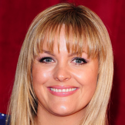
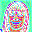
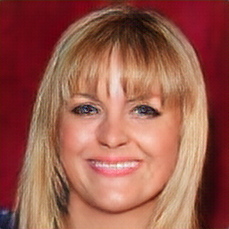
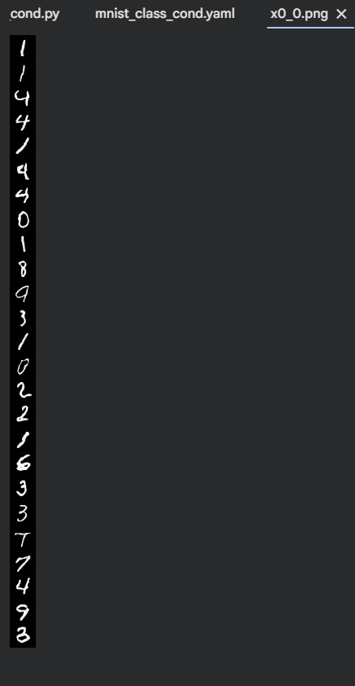
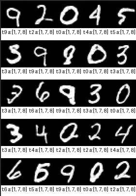
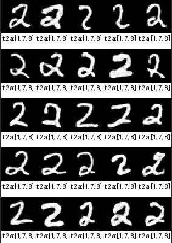
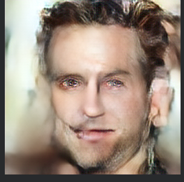
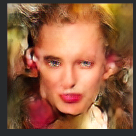

# 🎨 Negative Latent Diffusion Model

A PyTorch implementation of **Latent Diffusion Models** with **Negative/Avoid Conditioning** support. This project enables conditional image generation while actively avoiding specified classes during the diffusion process.


<!-- TODO: Add your architecture diagram here -->

---

## ✨ Features

| Feature | Description |
|---------|-------------|
| 🔄 **VQ-VAE** | Vector Quantized Variational Autoencoder for latent space compression |
| 🎯 **Class Conditioning** | Generate images conditioned on specific classes |
| 🚫 **Avoid Conditioning** | Novel approach to steer generation away from unwanted classes |
| 📝 **Text Conditioning** | CLIP-based text embeddings for text-to-image generation |
| 🖼️ **Image/Mask Conditioning** | Condition generation on semantic masks |
| 📊 **Multi-Dataset** | Support for MNIST and CelebA-HQ datasets |

---

## 🖼️ Sample Outputs

### Autoencoder Reconstruction on CelebHQ
| Input | Encoded | Reconstruction |
|-------|---------|----------------|
|  |  |  |

### Unconditional Generation on MNIST
| Class Random |
|---------|
|  |

### Avoid Conditioning Example
| Target: random, 
  Avoid: [1, 7, 8] |
|--------------------------|
|  |

| Target: 2, 
  Avoid: [1, 7, 8] 'less trained' |
|--------------------------|
|  |

| Target: 2, 
  Avoid: [1, 7, 8] 'more trained' |
|--------------------------|
|  |

### Text + Mask Conditional on CelebHQ
| Text Prompt | Generated Image |
|-------------|-----------------|
| "Condition: A young man with short hair" |  |
| "Condition: Man,       Negative: Mustache, Beard, Facial Hair" |  |

---

## 🏗️ Architecture

```
Input Image (256x256)
        ↓
   ┌─────────┐
   │ VQ-VAE  │ ──→ Latent Space (z)
   │ Encoder │
   └─────────┘
        ↓
   ┌─────────┐     ┌──────────────────┐
   │  UNet   │ ←── │ Conditioning     │
   │ Denoiser│     │ • Class          │
   └─────────┘     │ • Avoid Classes  │
        ↓          │ • Text (CLIP)    │
   ┌─────────┐     │ • Mask/Image     │
   │ VQ-VAE  │     └──────────────────┘
   │ Decoder │
   └─────────┘
        ↓
Output Image (256x256)
```

---

## 📁 Project Structure

```
negative_latent_diffusion_model/
├── config/                          # Configuration files
│   ├── mnist.yaml                   # MNIST unconditional
│   ├── mnist_class_cond.yaml        # MNIST class conditional
│   └── celebhq_text_image_cond.yaml # CelebHQ text+mask conditional
├── data/                            # Dataset directory
│   ├── mnist/
│   └── CelebAMask-HQ/
├── dataset/                         # Dataset loaders
│   ├── mnist_dataset.py
│   └── celeb_dataset.py
├── models/                          # Model architectures
│   ├── vqvae.py                     # VQ-VAE implementation
│   ├── unet_base.py                 # Base UNet architecture
│   ├── unet_cond_base.py            # Conditional UNet
│   ├── blocks.py                    # Building blocks (attention, resnet)
│   ├── discriminator.py             # PatchGAN discriminator
│   ├── lpips.py                     # Perceptual loss
│   └── weights/                     # Pre-trained weights
├── scheduler/                       # Noise schedulers
├── tools/                           # Training & sampling scripts
│   ├── train_vqvae.py               # Train VQ-VAE autoencoder
│   ├── train_ddpm_cond.py           # Train conditional DDPM
│   └── sample_ddpm_class_cond.py    # Sample from trained model
└── utils/                           # Utility functions
```

---

## 🚀 Setup

### Installation

```bash
# Clone repository
git clone https://github.com/yourusername/negative_latent_diffusion_model.git
cd negative_latent_diffusion_model

# Create conda environment
conda create -n ldm python=3.10
conda activate ldm

# Install dependencies
pip install -r requirements.txt
```

### Download LPIPS Weights

Download VGG weights for perceptual loss from [this link](https://github.com/richzhang/PerceptualSimilarity/blob/master/lpips/weights/v0.1/vgg.pth) (open in browser, download raw file).

Place the file at:
```
models/weights/v0.1/vgg.pth
```

---

## 📂 Data Preparation

### MNIST

```
negative_latent_diffusion_model/
└── data/
    └── mnist/
        ├── train/
        │   └── images/
        │       └── *.png
        └── test/
            └── images/
                └── *.png
```

### CelebA-HQ (Unconditional)

Download images from [CelebMask-HQ official repo](https://github.com/switchablenorms/CelebAMask-HQ).

```
negative_latent_diffusion_model/
└── data/
    └── CelebAMask-HQ/
        └── CelebA-HQ-img/
            └── *.jpg
```

### CelebA-HQ (Mask Conditional)

```
negative_latent_diffusion_model/
└── data/
    └── CelebAMask-HQ/
        ├── CelebA-HQ-img/
        │   └── *.jpg
        ├── CelebAMask-HQ-mask-anno/
        │   └── 0/1/2/.../14/
        │       └── *.png
        └── CelebAMask-HQ-mask/
            └── *.png
```

Create mask images from annotations:
```bash
python -m utils.create_celeb_mask
```

### CelebA-HQ (Text Conditional)

Download captions from [MM-CelebA-HQ-Dataset](https://github.com/IIGROUP/MM-CelebA-HQ-Dataset).

```
negative_latent_diffusion_model/
└── data/
    └── CelebAMask-HQ/
        ├── CelebA-HQ-img/
        │   └── *.jpg
        └── celeba-caption/
            └── *.txt
```

---

## 🎮 Training

### Step 1: Train AutoEncoder (VQ-VAE)

```bash
# MNIST
python -m tools.train_vqvae --config config/mnist.yaml

# CelebHQ
python -m tools.train_vqvae --config config/celebhq_text_image_cond.yaml
```

### Step 2: Train Conditional LDM

```bash
# Class Conditional (MNIST)
python -m tools.train_ddpm_cond --config config/mnist_class_cond.yaml

# Text + Mask Conditional (CelebHQ)
python -m tools.train_ddpm_cond --config config/celebhq_text_image_cond.yaml
```

### Step 3: Sample from Model

```bash
python -m tools.sample_ddpm_class_cond --config config/mnist_class_cond.yaml
```

---

## ⚙️ Configuration

### Key Parameters

| Parameter | Description | Default |
|-----------|-------------|---------|
| `num_timesteps` | Diffusion timesteps | 1000 |
| `ldm_epochs` | Training epochs | 100 |
| `ldm_batch_size` | Batch size | 64 |
| `ldm_lr` | Learning rate | 1e-5 |
| `lr_scheduler` | LR scheduler type | cosine |
| `cf_guidance_scale` | Classifier-free guidance scale | 1.0 |
| `autoencoder_acc_steps` | Gradient accumulation steps | 4 |
| `save_latents` | Save latents for faster DDPM training | False |

### Avoid Conditioning Parameters

| Parameter | Description | Default |
|-----------|-------------|---------|
| `use_avoid_conditioning` | Enable avoid conditioning | true |
| `avoid_drop_prob` | Dropout probability for avoid | 0.1 |
| `max_avoid` | Maximum classes to avoid | 3 |
| `cond_drop_prob` | Conditional dropout | 0.1 |

### Conditioning Config Examples

**Class Conditional:**
```yaml
condition_config:
  condition_types: ['class']
  class_condition_config:
    num_classes: 10
    cond_drop_prob: 0.1
    avoid_drop_prob: 0.1
    max_avoid: 3
```

**Text + Mask Conditional:**
```yaml
condition_config:
  condition_types: ['text', 'image']
  text_condition_config:
    text_embed_model: 'clip'
    text_embed_dim: 512
    cond_drop_prob: 0.1
  image_condition_config:
    image_condition_input_channels: 18
    image_condition_output_channels: 3
    cond_drop_prob: 0.1
```

---

## 🎯 Avoid Conditioning

This project introduces **Negative/Avoid Conditioning**, a novel approach that allows the model to actively steer generation away from specified classes.

### How It Works

1. During training, random classes are marked as "avoid" targets
2. The model learns to generate images that are NOT similar to avoided classes
3. At inference, you can specify which classes to avoid

### Example Usage

```python
# Generate digit "7" while avoiding "1" and "9"
samples = sampler.generate(
    target_class=7,
    avoid_classes=[1, 9],
    num_samples=16
)
```

---

## 📤 Output Structure

### AutoEncoder Training
```
task_name/
├── vqvae_autoencoder_ckpt.pth      # Latest autoencoder checkpoint
├── vqvae_discriminator_ckpt.pth     # Latest discriminator checkpoint
└── vqvae_autoencoder_samples/       # Reconstruction samples
    └── current_autoencoder_sample_*.png
```

### DDPM Training
```
task_name/
├── ddpm_ckpt_class_cond.pth         # Latest DDPM checkpoint
├── vqvae_latents/                   # Saved latents (if enabled)
└── samples/                         # Generated samples
    ├── x0_999.png                   # Latent at T=999
    ├── x0_998.png                   # Latent at T=998
    ├── ...
    └── x0_0.png                     # Final generated image
```

### Conditional Sampling
```
task_name/
├── cond_class_samples/              # Class conditional samples
├── cond_text_samples/               # Text conditional samples
└── cond_text_image_samples/         # Text + mask conditional samples
```

---

## 📚 Model Components

### VQ-VAE (Vector Quantized VAE)

- **Encoder**: Downsamples images to latent space
- **Codebook**: Discrete latent representations (8192 codes)
- **Decoder**: Reconstructs images from latents

### UNet Denoiser

- **Attention Blocks**: Self-attention at multiple scales
- **Time Embedding**: Sinusoidal timestep encoding
- **Condition Injection**: Cross-attention for conditioning

### Loss Functions

| Loss | Weight | Purpose |
|------|--------|---------|
| MSE Reconstruction | 1.0 | Pixel-level accuracy |
| Perceptual (LPIPS) | 1.0 | Feature-level similarity |
| Codebook | 1.0 | Discrete representation learning |
| Commitment | 0.2 | Encoder commitment to codebook |
| Adversarial | 0.5 | GAN-based realism (after disc_start steps) |

---

## 🔧 Custom Dataset

To train on your own dataset:

1. **Create config file** based on `celebhq_text_image_cond.yaml`

2. **Create dataset class** returning:
```python
# Unconditional
return image_tensor

# Conditional
return (image_tensor, {
    'class': class_index,           # For class conditioning
    'text': 'caption string',       # For text conditioning
    'image': mask_tensor            # For mask conditioning
})
```

3. **Register dataset** in training script:
```python
im_dataset_cls = {
    'mnist': MnistDataset,
    'celebA': CelebDataset,
    'celebhq': CelebDataset,
    'your_dataset': YourDataset  # Add here
}.get(dataset_config['name'])
```

---

## 📝 Citation

```bibtex
@misc{negative_ldm,
  title={Negative Latent Diffusion Model},
  author={Your Name},
  year={2024},
  url={https://github.com/yourusername/negative_latent_diffusion_model}
}
```

---

## 🙏 Acknowledgements

- [StableDiffusion-PyTorch](https://github.com/explainingai-code/StableDiffusion-PyTorch) - Base implementation
- [Latent Diffusion Models](https://github.com/CompVis/latent-diffusion)
- [DDPM](https://arxiv.org/abs/2006.11239)
- [VQ-VAE](https://arxiv.org/abs/1711.00937)
- [CLIP](https://github.com/openai/CLIP)

---

## 📄 License

This project is licensed under the MIT License - see the [LICENSE](LICENSE) file for details.
